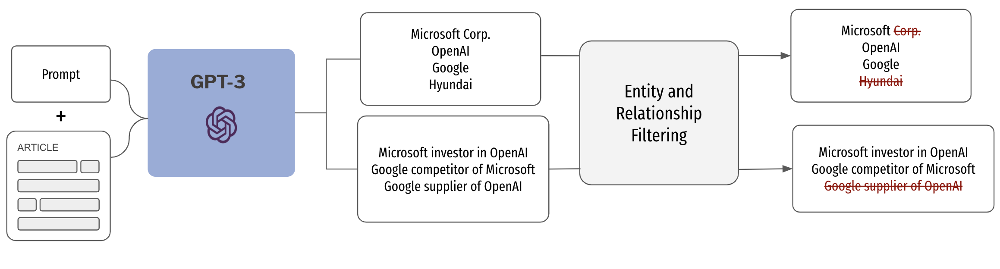
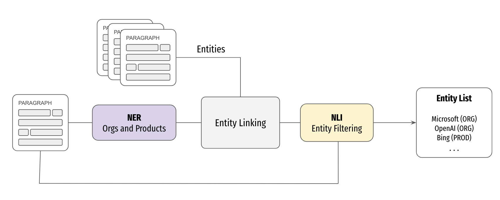
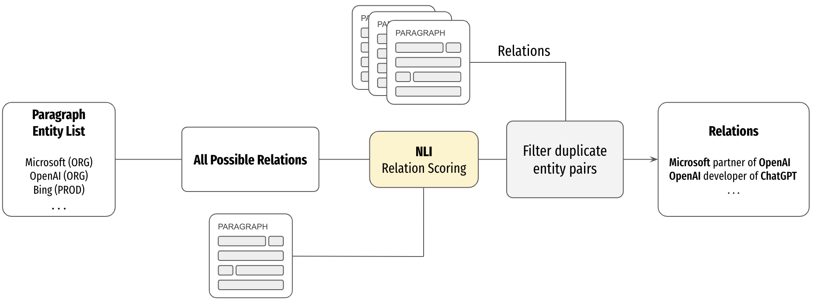

# News Articles Info Extraction

In this project, we explore 2 approaches for extracting business relations between companies and products:
- An LLM-based method using GPT-3 with a few-shot prompt.
- A PLM (Pre-trained Language Models)-based method, using a pipeline including NER and NLI models.

We compare the performance of the 2 approaches against a manual dataset of 54 news articles from February 2023, yielding over 250 relations and 200 entities.

Project developed by André Charneca during an internship at CYD Lausanne in 2023, supervised by Ljiljana Dolamic and Angelika Romanou.


## Visuals

<div style="text-align:center">
    
    <p>GPT-3 Pipeline</p>
</div>

<br>
<br>

<div style="text-align:center">
    
    <p>PLM pipeline: entity extraction</p>
</div>

<br>
<br>

<div style="text-align:center">
    
    <p>PLM Pipeline: relation extraction</p>
</div>


## Getting Started
Prepare to run scripts by doing the following:
```
git clone https://github.com/andrecharneca/News-Info-Extraction.git
cd News-Info-Extraction
pip install -r requirements.txt
```
Note: the GPT-3 pipeline uses the environment variable `OPENAI_API_KEY`.

## Usage
The main scripts in the folder `code/scripts` are:

- `create_articles_and_manual_annotations.py`: creates a `.json` file for every manually annotated article in the manual data (`data/raw/Business news articles - Manual Articles.csv`) to the folder `data/articles`. This is necessary to do **once** before running the models.
- `run_pipelines.py`: runs the GPT and PLM pipelines on the articles and saves the outputs to `.json` files in `data/results/[pipeline name]`.
- `compute_metrics.py`: computes the metrics for the GPT and PLM pipelines.


## Main Packages Used
- [HuggingFace Transformers](https://huggingface.co/transformers/) (for PLM pipeline)
- OpenAI API
- [Newspaper3k](https://newspaper.readthedocs.io/en/latest/) (for extracting news articles)
- [cleanco](https://pypi.org/project/cleanco/) (to remove legal suffixes from company names)

